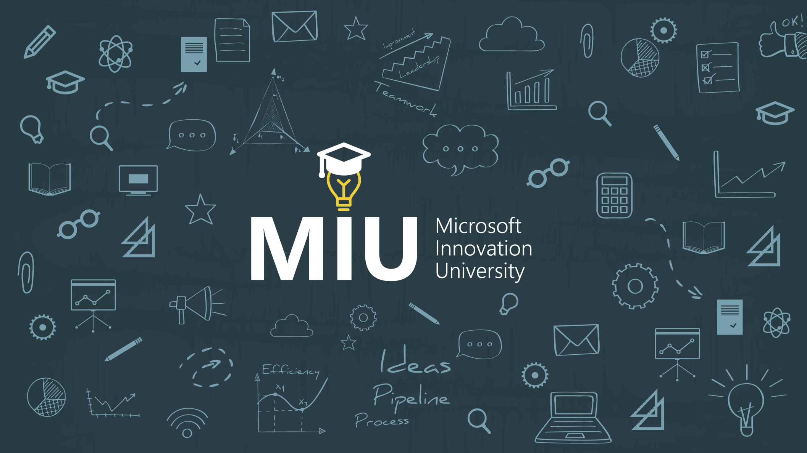

# Microsoft Innovation University @ Farfetch

Microsoft Innovation University (MIU) is designed to help you ensure that your technical people are aware of the latest advances in technology and gain the knowledge and skills they need to use them to make your company competitive in the economy of the future.

## Sessions content & Calendar

| Date | Presentation and Demos |
| -- | -- |
| 04-05-2017 | [What's new in VS2017 & Containers](MIU04052017) |

### What is MIU and how does it work?

Through the MIU program we bring you regular technical innovation sessions taught by our best experts. You select the topics you think are most relevant to your specific challenges and needs from our innovation technology portfolio and agree with us on a rhythm that works for you - 2 sessions a week, once a month or any other cadence that suits you and your people best. 

For each innovation topic you select, there will be two kinds of sessions: 
 - Technical Overview Session: These are sessions where our experts introduce a new technology and demonstrate it. The expert and the participants will decide on a follow-up set of tasks to gain a deeper hands-on knowledge of the subject being introduced.
 - Deep-dive/Office Hours: After the initial technology session, participants are expected to spend some time on their own exploring the technology and executing the tasks initially agreed on. A second follow-up session on the same subject will allow participants to remove blockers, discuss achieved results and further enhance their skills.

Then, at the end of every quarter, we will support you in recognizing the most valued professionals in your company who participated and showed great progress with MIU at the Microsoft Innovation University Quarter-End Event. You tell us who your top students are: either because they greatly evolved their technical skills as a result of their commitment to the sessions or because they used what they learned to contribute with projects or ideas that had a great impact on your business. We then invite them to our office for an event where we show them what’s next in technology and award their participation and commitment to innovation through MIU.

